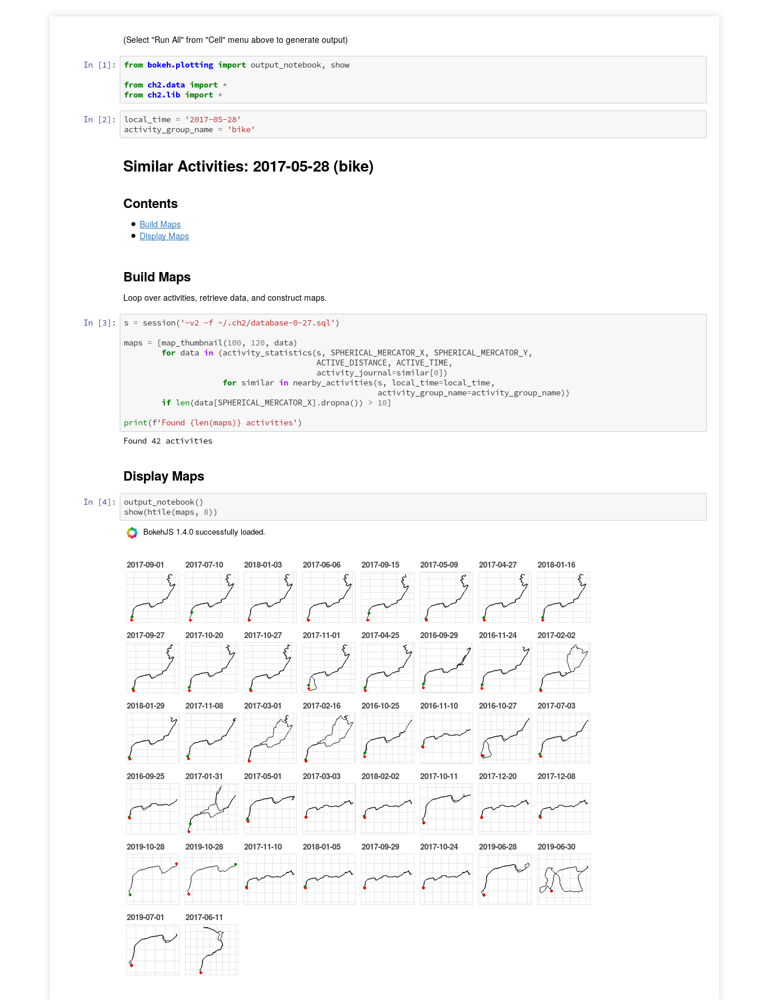
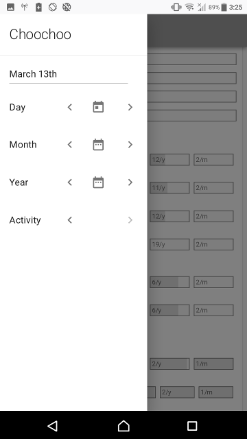
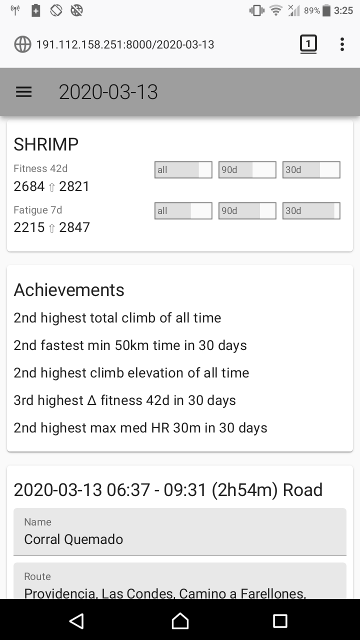

# Choochoo (ch2)

An **open**, **hackable** and **free** training diary.

    > python3.7 -m venv env
    > source env/bin/activate
    > pip install choochoo
    > ch2 config default
    > ch2 constants set FTHR.Bike 154          # or whatever your FTHR is
    > ch2 help
    > ch2 web start  # web interface to diary
    > ch2 diary      # terminal interface to diary

You will also need to configure and download elevation data if your
device does not have a barometer.  See
[here](https://andrewcooke.github.io/choochoo/elevation#configuration).

Please see the [full
documentation](https://andrewcooke.github.io/choochoo/).  This page
contains only some images and a [Technical
Overview](#technical-overview).

Below are examples of some of the included Jupyter templates.  They
can be displayed from the diary, the web interface, or via `ch2
jupyter` and provide an introduction to doing your own analysis.

## Technical Overview

The system includes:

* An SQLite3 database containing time series data.

* An interface to move data between the database and Pandas
  DataFrames.

* A FIT reader to import new data.

* Algorithms to derive new statistics from the data (using Pandas for
  efficiency).

* Pipelines to apply the algorithms to new data on import (in parallel
  processes for efficiency).

* An embedded Jupyter server to explore the data.

* Pre-written scripts to present graphical data views via Jupyter.

* A "diary" (using curses in the terminal) to present textual data and
  allow data entry.

* A web interface that is currently similar to the diary, but which I
  hope to extend into a more general interface to the entire system.

The database has an SQLAlchemy ORM interface.  The schema separates
"statistics" (named time series data) from the source (which might be
direct entry, read from a FIT file, or calculated from pre-existing
values).  SQL tracks dependencies to avoid stale values.

The pipelines are Python classes whose class names are also configured
in the database.

The data are stored in an "open" format, directly accessible by third
party tools, and easily backed-up (eg by copying the database file).
When the database format changes scripts are provided to migrate
existing data (see package `ch2.migraine`).  Data extracted from FIT
files are *not* migrated - they must be re-imported.

Support libraries include: FIT file parsing; spatial R-Trees; reading
elevation data from SRTM files; estimating power from elevation and
speed; Fitness / Fatigue models; detection of pre-defined segments;
clustering of routes; climb detection.

The "diary" view, where the user enters data, is also configured via
the database.  So the fields displayed (and the statistics collected)
can be customized.  This configuration can include "schedules" which
control when information is displayed (eg: weekdays only; every other
day; second Sunday in the month).

The combination of customizable diary fields and scheduling allows
training plans to be entered and displayed.  This presents a steep
learning curve but is ultimately very flexible - "any" training plan
can be accommodated.  Python code for generating example plans is
included (see package `ch2.config.plan`).

Currently the program is single-user (ie the data in the database are
not grouped by user).  Multiple users can co-exist using separate
database files.

*Choochoo collects and organizes time-series data using
athlete-appropriate interfaces.  It facilitates calculations of
derived statistics and extraction of data for further analysis using
Python's rich data science tools.  Both data and code are open and
extensible.*
