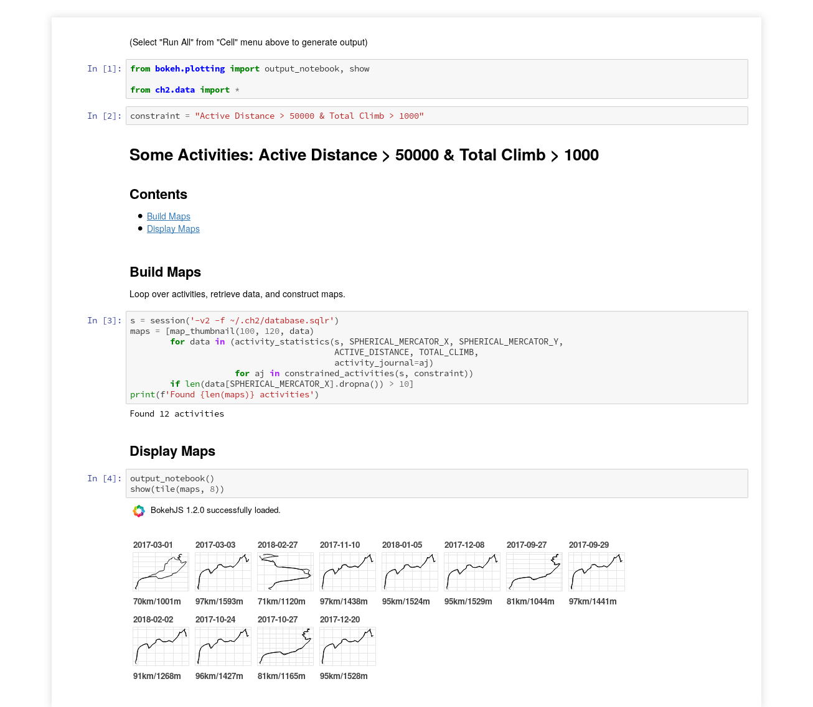

# Data Analysis

Below I focus on data access via [pandas](https://pandas.pydata.org/)
and [Jupyter](http://jupyter.org/) - this will let you read,
manipulate and plot data within your web browser.

  * [Starting Jupyter](#starting-jupyter)
  * [Quick Start](#quick-start)
    * [Predefined Scripts](#predefined-scripts)
      * [Calendar](#calendar)
      * [Activity Details](#activity-details)
      * [Activity Search](#activity-search)
    * [Roll Your Own](#roll-your-own)
  * [Slow Start](#slow-start)
    * [Session](#session)
    * [Helpers](#helpers)
      * [Statistics](#statistics)
      * [Waypoints](#waypoints)
    * [SQLAlchemy ORM Query](#sqlalchemy-orm-query)
    * [DataFrames](#dataframes)
  * [Plotting Data](#plotting-data)
  * [Summary](#summary)
  * [Other Approaches](#other-approaches)

## Starting Jupyter

There are various ways of starting Jupyter:

  * **Via choochoo**: `ch2 jupyter start` (this is what is used in
    [Quick Start](#quick-start) below),

  * **Standalone**: `jupyter notebook` (if you installed choochoo in a
    virtualenv you will need to use that),

  * **Your current workflow**: if you already use Jupyter you may want
    to add choochoo to your `PYTHONPATH` and then access your data via
    your usual tools.

## Quick Start

### Predefined Scripts

Choochoo includes some Jupyter scripts that will help you get started.
Many of these can be accessed via the diary (by clicking on "links")
and all can be accessed from the command line.

To see the scripts available type

    ch2 jupyter list

#### Calendar

To start a specific script, use `ch2 jupyter show` followed by the
script name and any parameters.  For example:

    ch2 show calendar

Once the script appears in your browser select "Run All" from the
"Cell" menu and you should see something like:

#### Activity Details

On the calendar identify an interesting activity and note the date
(move the mouse over the plot for more data).  Then you can see the
data for that activity:

    ch2 show activity_details 2017-11-05 bike

The second argument is the activity group name.  If you're unsure,

    ch2 dump table ActivityGroup

will list the names.

After selecting "Run All" again, you should see something like:

#### Activity Search

Sometimes you want to locate a particular activity, or all activities
that meet some condition.  The `some_activities` script lets you
search by statistic.  For example:

    ch2 show some_activities 'Active Distance > 50000 & Total Climb > 1000'

(note that units here are metres).  For me, this shows:

### Roll Your Own

You can modify the scripts in the browser and re-run all cells or
individual cells.

You can also write your own script templates.  See the
[ch2.uranus.template](https://github.com/andrewcooke/choochoo/tree/master/ch2/uranus/template)
package in the source.

## Slow Start

Pandas works with `DataFrame` objects, while Choochoo stores data in
an SQLite database with SQLALchemy ORM mapping.  Fortunately these
technologies work well together.  The learning curve is fairly steep,
but the result is very flexible access to the data.

### Session

To connect to the database we need a session:

    In[] > from ch2.data import *
           s = session('-v4')

where the `session` function takes arguments similar to `ch2 no-op` on
the command line.

### Helpers

The techniques below are needed to fully master the data, but two
helper functions provide simplified access.

#### Statistics

The `statistics` function retrieves a DataFrame of the given statistic
names, indexed by date:

    In[] > df = statistics(s, 'Active Distance', 'Heart Rate')

#### Activity Statistics

Often you want to access data associated with an **ActivityJournal**.
This information can be extracted as a single DataFrame using the
`waypoints` function:

    In[] > df = activity_statistics(s, 'Speed', local_time='2017-05-11',
                                    activity_group_name='Bike')

#### Other

Look in
[ch2.data.frame](https://github.com/andrewcooke/choochoo/blob/master/ch2/data/frame.py)
to see all the available functions.

### Sqlalchemy ORM Query

Using the session we can extract data from the database as Python
objects.  In practice (see below) we will not use these objects
directly.  Instead we will wrap the data in DataFrames.  But we will
use the same SQLAlchemy queries.  This lets us use all the power of
SQL to make conditional queries across multiple tables of data.

Our basic tools are:

  * The [Data Model](data-model), which is embodied in the [table
    classes](https://github.com/andrewcooke/choochoo/tree/master/ch2/squeal/tables)
  * The [SQLAlchemy Query
    API](http://docs.sqlalchemy.org/en/latest/orm/query.html)

Using these we can, for example, see all **StatisticName** instances
that have units of "bpm":

    In[] > from ch2.squeal import *
           names = s.query(StatisticName). \
                     filter(StatisticName.units == 'bpm').all()
           str(names[0])    
    '"Rest HR" (Topic/Topic "Diary" (d))'

### DataFrames

The same data can be retrieved as a DataFrame using the `df` function:

    In[] > names = df(s.query(StatisticName).
                        filter(StatisticName.units == 'bpm'))
           names
    [...table of information...]

## Plotting Data

Plotting packages in Python - especially for maps - seem to be
unreliable, so the emphasis here is on providing the data in a
standard format.  Hopefully you can then display that data with
whatever you find works for you.  Current examples use
[Bokeh](https://bokeh.pydata.org/), although if you dig aorund you may
also find a small amount of [Matplotlib](https://matplotlib.org/).

For examples of how to plot this data see:

* The template scripts described in [Quick Start](#quick-start).
* The Jupyter notebooks in the `notebooks` directory - these use Bokeh.
* The code in `tests/test_data.py` - these use Matplotlib.

Helper routines are available in
[ch2.data.plot](https://github.com/andrewcooke/choochoo/tree/master/ch2/data/plot).

## Summary

  * Find where the data are stored in the database:
    * consult the [Data Model](data-model) document;
    * examine the [table classes](https://github.com/andrewcooke/choochoo/tree/master/ch2/squeal/tables);
    * look at similar work in the `notebooks` directory;
    * explore the database using the `sqlite` client.
    
  * Create a [session](#session) in [Jupyter](#starting-jupyter).
  
  * Extract the data from the database:
    * use a [helper function](#helpers);
    * use a [SQLAlchemy ORM Query](#sqlalchemy-orm-query) and wrap the
      data in a DataFrame using `df`.
  
  * Plot the data with Bokeh or another, similar package.

## Other Approaches

All Choochoo's data (all *your* data) are stored in an SQLite3 file at
`~/.ch2/database-version.sql` (the version is numeric).  So you can
also use any programming language with an SQLite binding (for Python
the
[ch2.squeal.tables](https://github.com/andrewcooke/choochoo/tree/master/ch2/squeal/tables)
package contains a [SQLAchemy](https://www.sqlalchemy.org/) ORM
mapping).

