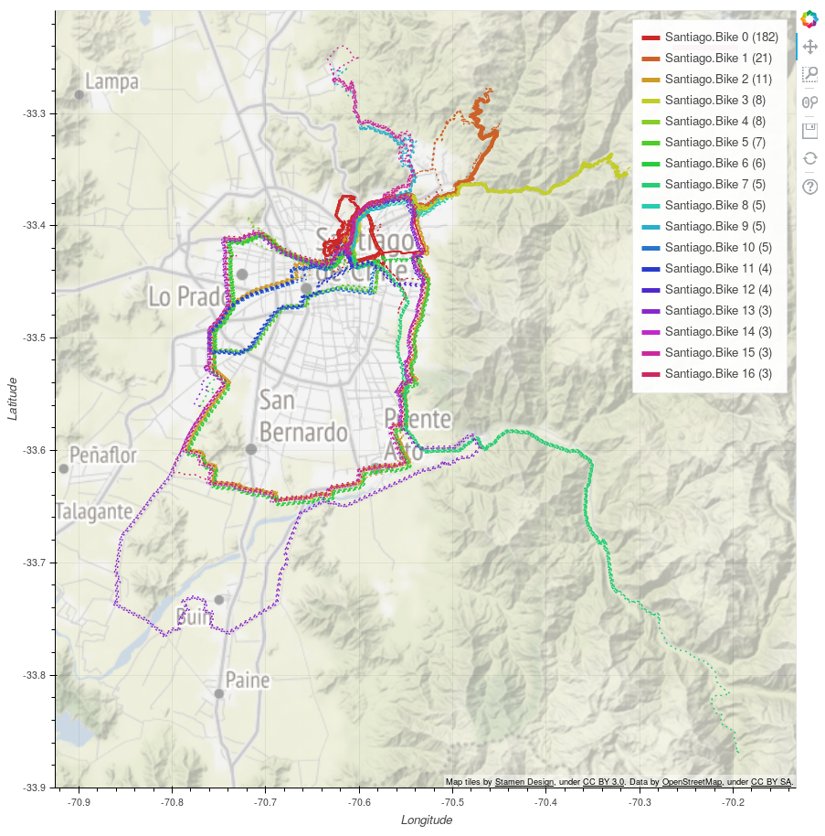

2018-12-15

# Nearby Activities

We have favourite routes when cycling.  But even when we repeat a ride
we make small chanegs - ride a little further, take a short-cut home,
explore a new diversion.

It would be good if Choochoo could identify these related routes.

## Contents

  * [Design](#design)
    * [Data Model](#data-model)
    * [Algorithm](#algorithm)
      * [Similarities](#similarities)
      * [Clustering](#clustering)

## Design

### Data Model

Two new tables are added to the database:

  * **ActivitySimilarity** is the (half-)matrix of similarity
    measurements.  For each pair of **ActivityJournal** IDs, it
    contains a float value, `similarity`, which is a measure of how
    similar the two routes were.

  * **ActivityNearby** associates similar **ActivityJournal**s into
    groups.

### Algorithm

Nearby activities are grouped in two stages:

  1. Similarities between pairs of activities are measured.
  2. Similar activities are grouped into clusters.

#### Similarities

This step compares all pairs of activities.  Each activity can contain
tens of thousands of GPS measurements.

The solution here:

  * Is O(n log(n)).  It is faster than quadratic, even though all
    pairs are considered.
  * Is "weakly" incremental.  It is less expensive to add a new
    activity than it is to re-process all activities, but the speed
    increase is only a constant factor.
  * Is robust.  The results are not strongly influenced by noise in
    the data or processing order.

In broad outline, the process is:

  * Use an [RTree](rtree) to store points from previous activities.

  * For each point in a new activity:
    * Count the number of "nearby" points from other activities.
    * Add the new points to the RTree.

  * The similarity measure for any pair of activities is the ratio of
    the number of nearvy points divided by the total number of
    points in the two datasets.

Checking for "nearby" points is done by extending the Minimum Bounding
Rectangle (MBR) around each point by a fixed amount (default 3m) and
then checking for MBR overlap.

The RTree returns both the matched MBR and the ActivityJournal ID
associated with the point.  The MBR is stored so that mutiple matches
are counted just once.

No account is taken of ride direction.  Segments of travel that are
ridden in both directions will "score double."  This does not appear
to strongly bias the results.

For incremental processing, points from previous activities must be
stored in the tree, but do not need to be queried.

The crude metric used (tangential plane to a sphere) means that all
calculations must be within a "small" area of latitude and longitude.
In practice this is sufficiently large for rides that start from a
single (eg home) location.  It is also possible to configure and
process multiple regions.

The similarity measure is symmetric and stored as a triangular matrix
in ActivitySimilarity.

### Clustering

The data are clustered using DBSCAN with a minimum cluster size of 3.
This is much faster than measuring similarities and is re-run
completely when needed.

The distance metric is calculated from the similarity by subtracting
the similarity from its maximum value and normalizing to 0-1.

The critical distance used to define clusters ("epsilon" in the DBSCAN
algorithm) is chosen to maximize the number of clusters.  The
appropriate value is chosen using an adaptive grid search.

## Results

