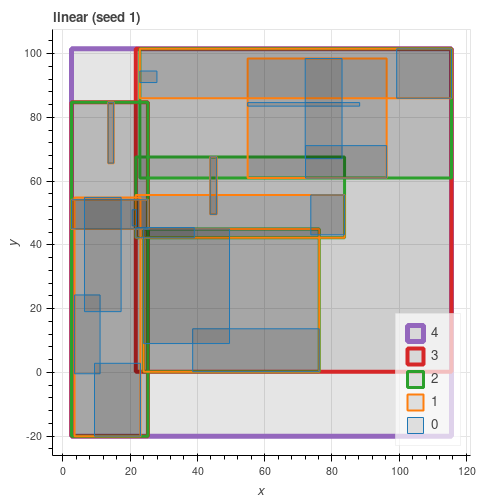

# Spatial Search

Choochoo includes a pure-Python RTree implementation ([Guttman
1984](https://github.com/andrewcooke/choochoo/blob/master/data/dev/guttman-r-trees.pdf)).

This can be used as a stand-alone library:

    from ch2.rtree import CLRTree, CQRTree, CERTree

(for Cartesian points, linear, quadratic and exponential split,
respectively).

## Contents

* [Design](#design)
* [Minimum Bounding Rectangles](#minimum-bounding-rectangles)
* [Points as Data](#points-as-data)
* [Other API Details](#other-api-details)
* [Split Algorithm](#split-algorithm)
* [Latitude / Longitude](#latitude--longitude)
* [Efficiency](#efficiency)
* [Extension](#extension)

## Design

The API evolved considerably to meet the following requirements:
  * Provide Python-like, intuitive defaults.
  * Support location data as *values* as well as keys.
  * Avoid 3rd-party dependencies or complex algorithms for polygon
    intersection.

The result provides:

  * Default methods (including `__getitem__`, `__setitem__`, `keys`,
    `values` and `items`) that provide a map from *points* to
    *multiple values*:

        > tree = CQRTree()
        > square = ((0,0),(0,1),(1,1),(1,0))
        > tree[square] = 'square'
        > tree[square]
        <iterator...>
        > list(tree[square])
        ['square']
        > square in tree
        True
        > diagonal = ((0,0),(1,1))
        > list(tree[diagonal])
        []
        > diagonal in tree
	False
        > list(tree.keys())
        [((0,0),(0,1),(1,1),(1,0))]
        > list(tree.values())
        ['square']
        > list(tree.items())
        > [(((0,0),(0,1),(1,1),(1,0)), 'square')]
        > len(tree)
        1
        > del tree[square]
        > len(tree)
        0

  * Extended retrieval based on MBRs (minimum bounding rectangles):

        > tree = CQRTree(default_match=MatchType.INTERSECTS)
	> tree[square] = 'square'
        > list(tree[diagonal])
        ['square']

  * The possibility to retrieve points (keys) as well as values:

        > tree = CQRTree(default_match=MatchType.INTERSECTS)
	> tree[square] = 'square'
        > list(tree.get_items(diagonal))
        [(((0,0),(0,1),(1,1),(1,0)), 'square')]

## Minimum Bounding Rectangles

Internally, the tree works with MBRs in Cartesian coordinates:

    (x_low_left, y_low_left, x_high_right, y_high_right)

Storage takes a list of `(x, y)` points, constructs the MBR, and saves
the original points together with the value in a leaf node.

So, for example, `add()` can be called with a single point `[(x, y)]`,
a rectangle `[(x1, y1), (x2, y2)]` or a polygon `[(x1, y1), (x2, y2),
...]`.

Queries (and deletions) support four match types:
* `EQUALS` - the request exactly matches the points in the tree
   (including point order).
* `CONTAINED` - the MBR of the request is contained within the MBR of
  the points in the tree.
* `CONTAINS` - the MBR of the request contains the MBR of the points
  in the tree.
* `INTERSECTS` - the MBR of the request intersects with the MBR of the
  points in the tree.

In all cases, multiple results may be returned (as an iterator).
Similarly, a single deletion may remove multiple (or no) entries.

Note that the default `EQUALS` retrieval returns values only where the
points match.  Other retrieval modes ignore the points and work only
with the MBR.

## Points as Data

Since the points may be important as *values* (as well as keys) they
are returned by `get_items()`.

The `value` parameter can be used to label different spatial datasets:

    for points in dataset_1: tree.add(points, 1)
    for points in dataset 2: tree.add(points, 2)
    # query for dataset_1 points in the given region
    tree.get_item(region, value=1, match=MatchType.CONTAINS)
    # delete all dataset_2 points
    tree.delete(tree.global_mbr, value=2, match=MatchType.CONTAINS)

(but note that the deletion may be less efficient than filtering
`.items()` and rebuilding the tree).

## Other API Details

The constructor (and `add_all()`) can take an iterable of `(points,
value)` pairs (as generated by `.items()`).

Any value can be stored.  Neither keys not values need be unique.

Use `delete_one()` to remove only the first match found.  Match order
may change when data are added or removed.

Modifying the tree while iterating over contents is unsafe (and should
trigger an error).

In the final API, MBRs are never visible to the caller.

## Split Algorithm

All three algorithms from the paper are implemented.  As can be seen
from the figures below, quadratic gives results close to exponential
and consistently better than linear.

## Latitude / Longitude

Basic RTree assumes Cartesian coordinates.

To provide *minimal* support for *local* latitude / longitude the
`LLRTree`, `LQRTree` and `LERTree` classes subtract the initial
longitude and normalize to (-180, 180] on input, reversing the
transform on output.

Longitude is "x", latitude "y".

With this normalization, longitude should work correctly provided data
do not cover more than half the available range.

No correction is made to latitude - this will not work correctly when
overlapping the poles.

This could also work with phase, or any other angular measure in
degrees.

## Efficiency

Profiling suggests that most time is spent comparing MBRs (evaluating
`max()` and `min()`).  This occurs on descent and argues for small
(more discriminatory) nodes.  This is supported by timing tests
across different entry sizes - `max_entries` of 3 appears optimal.

Exponential split is slower than quadratic or linear at any entry
size.

## Extension

The tree was designed for further extension via mixins.  Please see
the
[code](https://github.com/andrewcooke/choochoo/blob/master/ch2/arty/tree.py).
