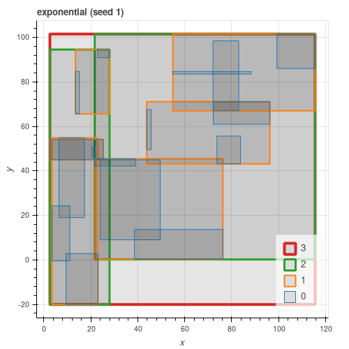

# Spatial Search

Choochoo includes a pure-Python RTree implementation ([Guttman
1984](https://github.com/andrewcooke/choochoo/blob/master/data/dev/guttman-r-trees.pdf)).

This can be used a stand-alone library:

    from ch2.rtree import CLRTree, CQRTree, CERTree

(for Cartesian points, linear, quadratic and exponential split,
respectively).

## Contents

* [Regions](#regions)
* [Match Type](#match-type)
* [Split Algorithm](#split-algorithm)
* [Latitude / Longitude](#latitude--longitude)
* [Extension](#extension)

## Regions

The tree works with *boxes* in Cartesian coordinates:

    (x_low_left, y_low_left, x_high_right, y_high_right)

These are normalized on input (so any two opposite corners will work).

In addition, *points* can be provided as input.  They are expanded
internally (and returned) as zero-area boxes.

## Match Type

Queries (and deletions) can be made with four match types:
* **Equal** - the request exactly matches a value in the tree,
* **Contained** - the request is contained within a value in the tree.
* **Contains** - the request contains a value within the tree.
* **Intersects** - the request intersects a value within the tree.

In all cases, multiple results may be returned (as an iterator).
Similarly, a single deletion may remove multiple (or no) entries (the
number of deletions is returned).

There are no restrictions on duplicate keys or values.

## Split Algorithm

All three algorithms from the paper are implemented.  As can be seen
from the figures below, quadratic gives results close to exponential.
Timing measurements indicate quadratic has a similar speed to linear
for node groups of size 4-8.

## Latitude / Longitude

Basic RTree assumes Cartesian coordinates.

To provide *minimal* support for *local* latitude / longitude the
`LLRTree`, `LQRTree` and `LERTree` classes subtract the initial
longitude and normalize to (-180, 180] on input, reversing the
transform on output.

Longitude is "x", latitude "y".

With this normalization, longitude should work correctly provided data
do not cover more than half the available range.

No correction is made to latitude - this will not work correctly when
overlapping the poles.

This could also work with phase, or any other angular measure in
degrees.

## Extension

The tree was designed for further extension via mixins.  Please see
the
[code](https://github.com/andrewcooke/choochoo/blob/master/ch2/arty/tree.py).
