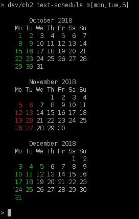

# Schedules

Schedules are used to specify ranges of dates, typically involving
some kind of repetition.  They are very flexible, but I've tried to
make the simple cases easy to write and understand.

Before getting into any details it's best to look at some examples:

* **2018-10-07**

  This is a single date - the day that I am writing this document,
  Sunday 7th of October, 2018.

* **2018-10-07-**

  This is all the days from today (Sunday) onwards (include the given
  date).

* **-2018-10-07**

  All the days before today (Sunday) (excluding the given date - date
  ranges are semi-open).

* **d**

  Every day (always - the open range).

* **2w**

  Every two weeks.  This may seem a strange thing to want to specify,
  but perhaps you want to calculate your total distance every
  fortnight?  If so, you'll need this to specify the interval in the
  statistics pipeline.

* **2w[1mon,2tue]**

  The first Monday and the second Tuesday in each fortnight (maybe you
  have some weird appointment you need to keep).

* **2018-10-07/2w[1mon,2tue]**

  The first Monday and second Tuesday in each fortnight when the
  fortnights are chosen so that Sunday 7th of October 2018 is in the
  first week (because weeks always start on Mondays, but you can still
  divide up time into fortnights in two different ways).

* **2018-10-07/2w[1mon,2tue]2019-01-01-2020-01-01**

  The first ... (as above) during all of 2019.

* **m[sun,5,10]**

  Every Sunday, every month.  Also, the 5th and 10th of the month.

Hopefully that gives the idea.  

* [Introduction](#introduction)
* [Structure](#structure)
  * [Offset](#offset)
  * [Repeat](#repeat)
  * [Locations](#locations)
  * [Range](#range)
* [Exploration](#exploration)  

## Structure

A schedule consists of four sections

    offset / repeat [ locations ] range

which are discussed below.  Many sections can be omitted if the
default value is sufficient.  The exact details are complex (to handle
common cases nicely) so the best guidance is probably to follow the
examples here.

### Offset

The offset is only useful if the repeat is larger than 1 (ie `2d`,
`3w` etc).  It allows you to choose the "alignment" of the repetition.
If a date is given that then things are aligned so that date fits into
the initial "unit" (day or month or whatever).  So, for example, if
the repeat is `3m` (three months) then the three months are chose so
that the given date is in the first month.

The offset can also be an integer, in which case it is the number of
"units" (day, month etc) offset from the start of the Unix epoch.  If
motted, a value of 0 is assumed.

The first form (date) is usually most useful when given by a human,
but the system will convert to the second form (units from start of
epoch) internally because this is moder directly useful in date
calculations.

### Repeat

This consists of a multiple (default 1) of "units", where a unit is
represented by a single letter (`d` for day, `w` for week, `m` for
month and `y` for year).  If no value is given, `d` is assumed.

The repeat defines the "frame" within which locations are placed.  To,
for example, if the repeat is `w` then the locations will identify
certain days within the week.

### Locations

These identify particular days within the frame given by the repeat.
They are written inside square brackets and separated by commas.

Day names (first three letters in english) can be used, as can simple
numbers (1 for Monday within a week, or day of week within a month).

It is also possible to use the form `2wed` to mean "the second
Wednesday".  In contrast, `fri` means "all Fridays".

If no location is given then *all* days are assumed.

No locations can be given for yearly repeats and numbered days
cannot be given for daily repeats.

### Range

This is a pair of dates, start and finish, separated by a dash.  The
range is semi-open and either can be omitted.  If both are omitted
then the dash should be omitetd too.

If a single date without leading or trailing dash is given, it is
taken as specifying a range of a single day (so has an implicit finish
value a day later).

## Exploration

You can use the

    ch2 test-schedule SCHEDULE

command to test what a given schedule "looks like".  This will print a
calendar with days that match the specification highlighted in red and
green.

For example:

